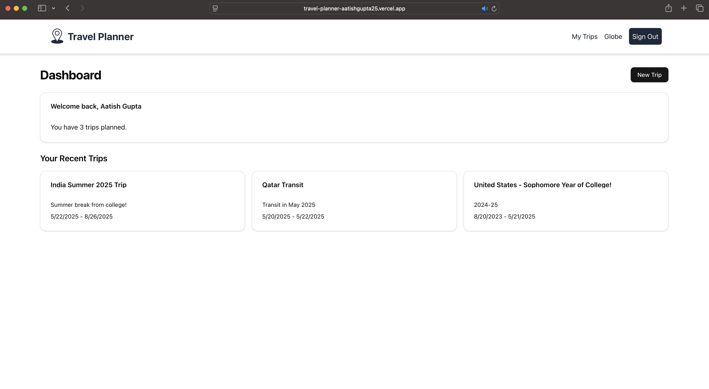
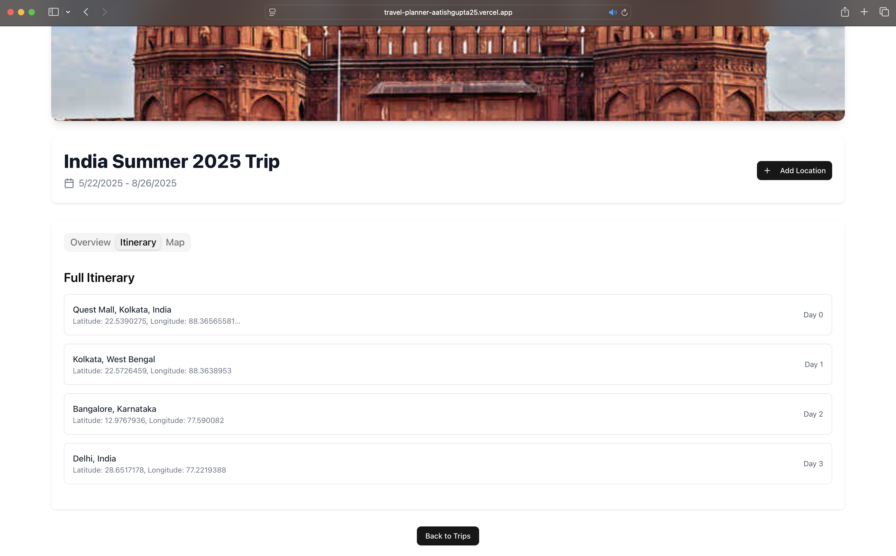
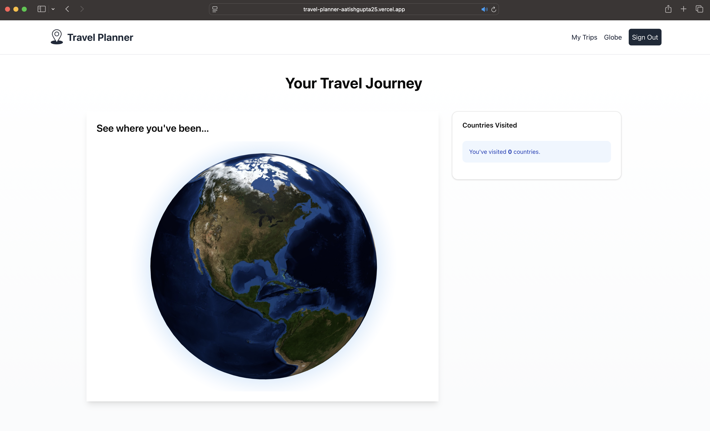

# Deployed on Vercel @ [Link](https://travel-planner-aatishgupta25.vercel.app)

- Built with Next.js
-  Used [Neon](https://neon.com) for DB, [uploadthing](https://uploadthing.com) for image storage, [LocationIQ](https://locationiq.com) for maps.
-  Detailed Docs [here](https://deepwiki.com/aatishgupta25/travel_planner?tab=readme-ov-file), thanks Devin!

